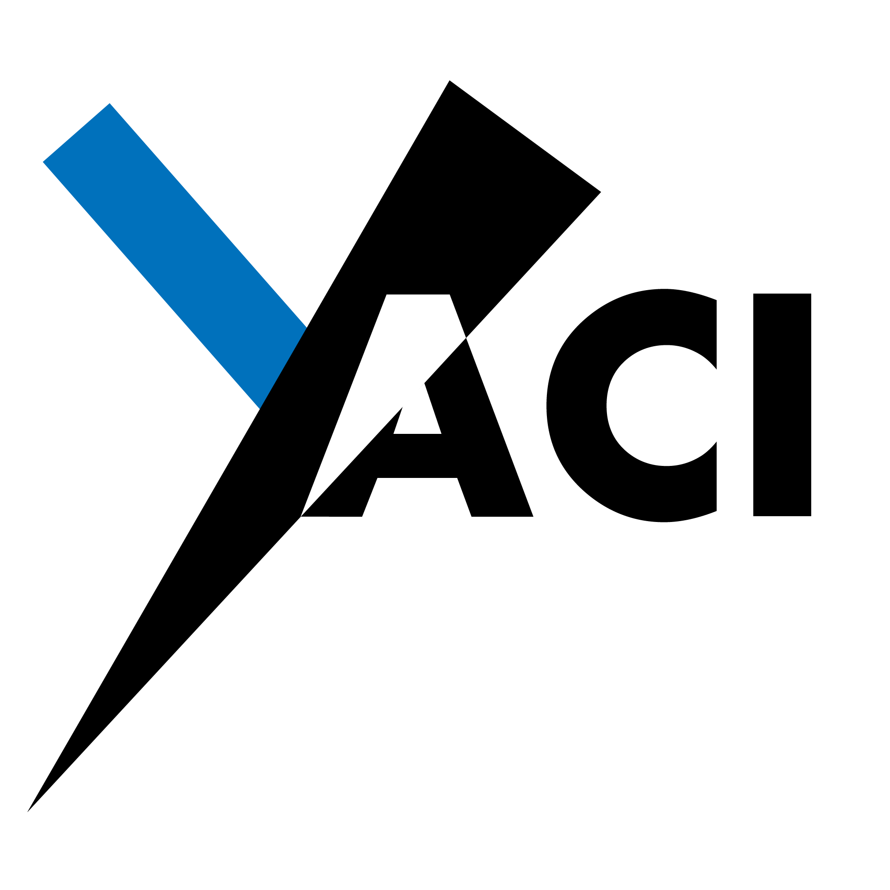

<div align="center">


<h4>A Cardano Mini Protocols implementation in Java</h4>

[](https://github.com/bloxbean/yaci-core/actions/workflows/build.yml)
[](#development-snapshots)
</div>

## Overview
Yaci is a Java-based Cardano mini-protocol implementation that allows users to connect to a remote or local Cardano node
and interact with it in a variety of ways. With Yaci's simple APIs, you can listen to incoming blocks in real-time, fetch 
previous blocks, query information from a local node, monitor the local mempool, and submit transactions to a local node.

**Latest Release :**
- [0.4.0](https://github.com/bloxbean/yaci/releases/tag/v0.4.0)

**Development Branch:** main

## Dependencies

Maven

```xml
<dependency>
    <groupId>com.bloxbean.cardano</groupId>
    <artifactId>yaci</artifactId>
    <version>{version}</version>
</dependency>
```

Gradle

```xml
 implementation('com.bloxbean.cardano:yaci:{version}')
```

New 0.5.x releases (branch `next`) are also in the BloxBean Maven repository, `https://repo.bloxbean.org/maven/releases`,
with the same files as on Maven Central. 0.4.x releases are on Maven Central only.

### Development snapshots

Development snapshots of the `next` branch are in the BloxBean Maven repository, one version per commit, for example
`0.5.0-pre14-1a2b3c4-SNAPSHOT`. The snapshot badge above shows the newest version.

```gradle
repositories {
    mavenCentral()
    maven {
        url = uri('https://repo.bloxbean.org/maven/snapshots')
        mavenContent { snapshotsOnly() }
    }
}

dependencies {
    implementation 'com.bloxbean.cardano:yaci:<snapshot version>'
}
```

## How to Use?

### [Documentation](docs/README.md)

### [Getting Started Guides](docs/GettingStarted.md)

## Status

| mini protocol            | initiator      |
|--------------------------|----------------|
| `n2n Handshake`          | Done           | 
| `n2n Block-Fetch`        | Done           |     
| `n2n Chain-Sync`         | Done           | 
| `n2n TxSubmission`       | In Progress    | 
| `n2n Keep-Alive`         | Done    | 
| `n2c Handshake`          | Done           | 
| `n2c Chain-Sync`         | Done           | 
| `n2c Local TxSubmission` | Done           | 
| `n2c Local State Query`  | Partially Done |
| `n2c Local Tx Monitor`   | Done   |


| Other tasks              | Status                                                        |
|--------------------------|---------------------------------------------------------------|
| `Block Parsing`          | Tx Inputs, Tx Outputs, MultiAssets, Mint, Certificate         |
| `Eras`                   | Done (Byron, Shelley, Alonzo, Babbage, Conway) |   
|                          |                                                               |


## Build

```
$> git clone https://github.com/bloxbean/yaci
$> ./gradlew clean build
``` 

# Any questions, ideas or issues ?

- Create a Github [Issue](https://github.com/bloxbean/yaci/issues)
- [Discord Server](https://discord.gg/JtQ54MSw6p)

# Support from YourKit

YourKit has generously granted the BloxBean projects an Open Source licence to use their excellent Java Profiler.


YourKit supports open source projects with innovative and intelligent tools
for monitoring and profiling Java and .NET applications.
YourKit is the creator of <a href="https://www.yourkit.com/java/profiler/">YourKit Java Profiler</a>,
<a href="https://www.yourkit.com/.net/profiler/">YourKit .NET Profiler</a>,
and <a href="https://www.yourkit.com/youmonitor/">YourKit YouMonitor</a>
