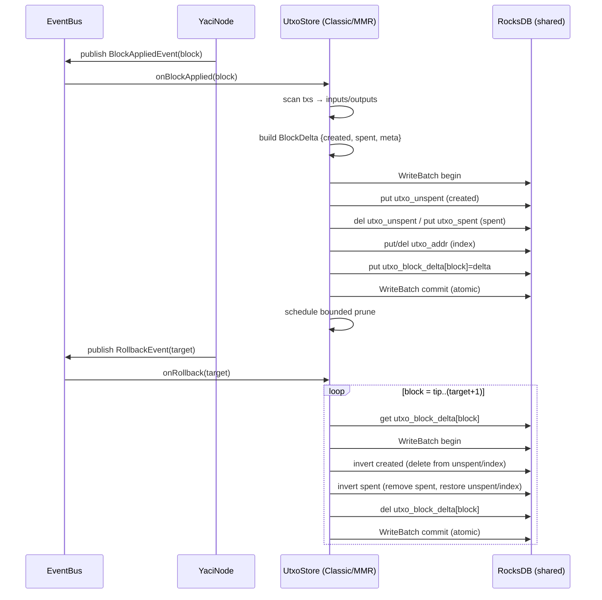
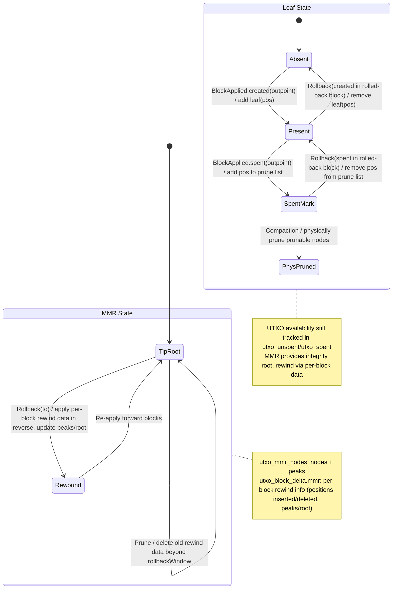

# ADR-004: UTXO State — Design and Plan

- Status: Proposed
- Date: 2025-09-10
- Authors: Yaci Node Team
- Modules: `node-api`, `node-runtime`, `node-app`, `events-core`, `events-processor`

## Context

Yaci Node already syncs headers and blocks using a RocksDB-backed `ChainState`. We want to add a UTXO state that:
- Tracks current unspent transaction outputs per address and by outpoint (txHash#index).
- Updates atomically per block, handles rollbacks, and prunes old spent data (safe after 2160 blocks).
- Shares the same RocksDB instance as `ChainState`, but is loosely coupled via the new domain event framework (`BlockAppliedEvent`, `RollbackEvent`).
- Offers two pluggable stores: a “classic” best-practice UTXO index (Bitcoin/Cardano-style) and an experimental Merkle Mountain Range (MMR)-based variant.
- Can be disabled via configuration.

## Goals

- Correct, atomic per-block updates (all-or-nothing) using RocksDB batches.
- Efficient queries: list current UTXOs for an address; lookup by outpoint.
- Rollback-safe: revert all updates for blocks above rollback point.
- Prune spent entries safely after configurable depth (default 2160 blocks).
- Single DB instance shared with `ChainState`; isolation via column families (CFs).
- Event-driven design with minimal coupling to the sync pipeline.

## Non-Goals (initial phase)

- Full ledger validation (we assume valid blocks’re applied by node pipeline).
- Inclusion proofs/accumulators beyond the MMR option (no SNARKs, etc.).
- Full Byron legacy peculiarities — initial focus is Shelley+ transactions; Byron support can follow.

## High-Level Architecture

- `UtxoState` (node-api): Public interface for UTXO storage and queries.
  - `getUtxosByAddress(address, page, pageSize)`
  - `getUtxo(outpoint)`
  - `getBalance(address)` (optional convenience)
  - Lifecycle: `start()`, `close()` (optional)
- Implementations (node-runtime):
  - `ClassicUtxoStore` (default): address index + unspent/spent sets.
  - `MmrUtxoStore` (experimental): maintains an MMR over UTXO leaves; still provides same query API using side indexes.
- Event listeners: subscribe to `BlockAppliedEvent` and `RollbackEvent` to update state.
- RocksDB integration: reuse `DirectRocksDBChainState`’s DB handle; add UTXO CFs.
- Configurable via `node-app` and `node-api` options; can be disabled.

## RocksDB Layout (shared DB, separate CFs)

Add new column families (names tentative):
- `utxo_unspent`: key = `txHash(32) | index(u16)`; value = encoded `UtxoRecord` (address, value, assets, datum/ref, scriptRef, createdSlot, createdBlock). Include `isCollateralReturn` (bool) and `referenceScriptHash` if scriptRef present (aligns with yaci-store schema).
- `utxo_spent`: key = same outpoint; value = encoded `SpentRecord` (spentSlot, spentBlock, spentByTxHash)
- `utxo_addr`: key = `addrHashOrBytes | outpoint` (composite); value = empty or small marker. Allows efficient prefix scans per address.
- `utxo_block_delta`: key = `blockNumber(u64)`; value = `BlockDelta` (lists of created outpoints and spent outpoints with prior values) for rollback.
- `utxo_meta`: misc metadata (e.g., pruneCursor, schemaVersion).
- `utxo_mmr_nodes` (MMR impl only): internal nodes + peaks storage. Leaves keyed by outpoint.

Notes:
- All UTXO writes happen through `WriteBatch` per block to guarantee atomicity.
- We use fixed-length binary keys where possible to reduce heap and comparison cost.
- Address keying: store raw address bytes (or Blake2b-224/addr hash if preferred) to keep keys compact; API accepts bech32 and we decode.
- Serialization: reuse `core` codecs where available; otherwise define compact binary for `UtxoRecord`/`SpentRecord`.

## Event-Driven Update Flow

- `BlockAppliedEvent` (post-store):
  - For each transaction:
    - For each input: mark corresponding outpoint as spent (move from `utxo_unspent` → `utxo_spent`), remove address index entry.
    - For each output: add new outpoint to `utxo_unspent` and insert into `utxo_addr` under the output address.
  - Build a `BlockDelta` containing:
    - `created`: list of outpoints with full `UtxoRecord` values.
    - `spent`: list of outpoints with the PRE-SPEND `UtxoRecord` values (to restore on rollback).
  - Apply all mutations in a single `WriteBatch`:
    - put `utxo_block_delta[blockNumber] = BlockDelta`
    - put/delete in `utxo_unspent`, `utxo_spent`, `utxo_addr`
    - update `utxo_meta.pruneCursor` opportunistically (see pruning)

- `RollbackEvent`:
  - Determine target rollback `Point` → resolve to `blockNumber` (from `ChainState`).
  - Iterate block numbers above target, highest → (target+1):
    - Read `BlockDelta` for each block.
    - In a single `WriteBatch` per block (or per rollback batch):
      - For each `created`: delete from `utxo_unspent` and `utxo_addr`.
      - For each `spent`: remove from `utxo_spent` if present and restore to `utxo_unspent` and `utxo_addr` using saved value.
      - Delete the `utxo_block_delta[block]` entry.
    - If spent entries were previously pruned due to depth, rollback scope must not surpass pruning horizon; we guard via `rollbackWindow >= pruneDepth`.

### Sequence (Apply and Rollback)



## Pruning Strategy

- Configurable `pruneDepth` (default 2160 blocks). Safe to prune spent UTXOs older than tipHeight - pruneDepth.
- Maintain `utxo_meta.pruneCursor = lastPrunedBlockNumber`.
- On each `BlockAppliedEvent`, after commit, schedule/lightweight prune pass:
  - Determine cutoff = `currentBlock - pruneDepth`.
  - Iterate `utxo_spent` by auxiliary index of spendBlock or by scanning deltas up to a budget (e.g., N entries per block) and delete old spent entries and related address index remnants (if any).
- Never prune below `rollbackWindow` (see below). If `rollbackWindow > pruneDepth`, use `rollbackWindow` for safety.

## Rollback Window and Safety

- Configure `rollbackWindow` (default 4320 blocks, i.e., >= 2×2160 for margin).
- Guarantee that data needed to reverse effects (including any not-yet-pruned `spent`) exists for last `rollbackWindow` blocks via `utxo_block_delta`.
- If a rollback request exceeds window, we still revert unspent creations (via deltas), but may not be able to restore entries pruned long ago. This matches common chain indexer practice; document clearly and expose metrics.

## Concurrency and Ordering

- Listener runs in the event pipeline after block body is stored (we use `BlockAppliedEvent`).
- Use a single-threaded consumer for UTXO mutations to preserve order; backpressure via event bus options if required.
- Use RocksDB `WriteBatch` and optionally `WriteOptions().setDisableWAL(false)` to ensure durability.
- Consider `Snapshot`/`readOptions` for consistent reads during large scans (e.g., API queries) if needed later.

## API Surface (node-api)

Introduce `UtxoState` interface with minimal query ops and life-cycle:
- `List<Utxo> getUtxosByAddress(String bech32OrHex, int page, int pageSize)`
- `Optional<Utxo> getUtxo(String txHash, int index)`
- `Value getBalance(String bech32OrHex)` (optional convenience)
- `boolean isEnabled()`

Also: `UtxoStoreType { CLASSIC, MMR }` in options and factories to pick impl.

## Configuration (node-app / runtime options)

- `yaci.node.utxo.enabled` (bool, default: true)
- `yaci.node.utxo.store` (enum: `classic` | `mmr`, default: `classic`)
- `yaci.node.utxo.pruneDepth` (int blocks, default: 2160)
- `yaci.node.utxo.rollbackWindow` (int blocks, default: 4320)
- `yaci.node.utxo.pruneBatchSize` (int, default: 500)
- `yaci.node.utxo.index.address_hash` (bool, default: true)
- `yaci.node.utxo.index.payment_credential` (bool, default: true)
- `yaci.node.utxo.indexingStrategy` (enum helper: `address_hash` | `payment_credential` | `both`, default: `both`)
- `yaci.node.utxo.delta.selfContained` (bool, default: false)

Expose in `node-app/src/main/resources/application.yml` and wire to `RuntimeOptions`/`PluginsOptions`.

## Data Structures

- `UtxoRecord`:
  - outpoint: `txHash`, `index`
  - address bytes (raw)
  - value: lovelace + multi-asset map
  - datumHash (opt), inlineDatum (opt, bounded), scriptRef (opt)
  - createdSlot, createdBlock
- `SpentRecord`:
  - outpoint
  - spentByTxHash
  - spentSlot, spentBlock
- `BlockDelta` (compact mode, default):
  - `created`: list of outpoints created in the block (we delete these on rollback)
  - `spent`: list of outpoints consumed in the block (we restore bodies from `utxo_spent`)
  - Optional per-tx flags / metadata
  - Note: no full UTXO bodies in delta by default to avoid duplication

- `BlockDelta` (self-contained mode, optional):
  - `created`: outpoint + full `UtxoRecord`
  - `spent`: outpoint + pre-spend `UtxoRecord`
  - Enables rollback beyond `pruneDepth` at storage cost

All encoded compactly (CBOR or custom varint + length-delimited). Keep values ≤ 120 chars per line in code, follow lombok usage where present.

### utxo_block_delta Structure (Detailed)

`BlockDelta` is the per-block reversible change-set we persist to enable precise rollbacks.

Common fields (both modes):
- `blockNumber (u64)` and `slot (u64)`; `blockHash (32)` for auditing.
- `created` (array): outpoint(s) created in the block.
- `spent` (array): outpoint(s) spent in the block.
- `flags`: `containsInvalidTx (bool)`; optional per-tx entries `{ txHash, isInvalid, hadCollateralReturn }`.
- `mmr` (MMR only): insertions/deletions descriptors, peaks/root.

Self-contained additions (only if `yaci.node.utxo.delta.selfContained=true`):
- For each `created`: include `utxoRecord` (full body at creation time).
- For each `spent`: include `preSpendUtxoRecord` and optionally `spentByTxHash`.

Rollback (compact mode): delete each `created` outpoint from `utxo_unspent` and address indexes; for each `spent` outpoint, read its `UtxoRecord` from `utxo_spent` and restore to `utxo_unspent` and indexes; delete the delta entry.

Rollback (self-contained mode): same as above but use bodies embedded in delta (does not depend on `utxo_spent`).

### BlockDelta Examples

Example 1 — Compact mode (default), valid block

JSON-like (logical fields; internal uses CBOR + binary):
{
  "block_number": 123456,
  "slot": 50000000,
  "block_hash": "a1..ff",
  "created": [
    {"tx_hash": "txA..01", "index": 0},
    {"tx_hash": "txA..01", "index": 1}
  ],
  "spent": [
    {"tx_hash": "inX..aa", "index": 0},
    {"tx_hash": "inY..bb", "index": 1}
  ],
  "flags": {"containsInvalidTx": false}
}

Example 2 — Compact mode, invalid tx (collateral consumed, collateral return produced)

{
  "block_number": 123457,
  "slot": 50000020,
  "block_hash": "b2..ee",
  "created": [ {"tx_hash": "txB..02", "index": 2} ],
  "spent": [ {"tx_hash": "col1..aa", "index": 0}, {"tx_hash": "col2..bb", "index": 1} ],
  "flags": {"containsInvalidTx": true},
  "txFlags": [
    {"txHash": "txB..02", "isInvalid": true, "hadCollateralReturn": true}
  ]
}

Example 3 — Compact CBOR-style (integer keys)

// {0:blockNumber,1:slot,2:blockHash,3:created,4:spent,5:flags}
{
  0: 123456,
  1: 50000000,
  2: h'a1..ff',
  3: [ { 0: [h'txA..01', 0] }, { 0: [h'txA..01', 1] } ],
  4: [ { 0: [h'inX..aa', 0] }, { 0: [h'inY..bb', 1] } ],
  5: { 0:false }
}

Self-contained variant (if enabled) would add to each created/spent entry the full `utxoRecord`/`preSpendUtxoRecord` maps as shown earlier.

How rollback applies a delta
- For each entry in `created`: delete the outpoint from `utxo_unspent` and its address index key.
- For each entry in `spent`: remove any `utxo_spent` record; restore the `preSpendUtxoRecord` back to `utxo_unspent` and reinsert its address index key.
- Delete the `utxo_block_delta[block_number]` entry after a successful batch commit.

## ClassicUtxoStore Algorithm Sketch

- On apply(block):
  - For each tx input: lookup `utxo_unspent[outpoint]` → if present, move to `utxo_spent` with spend info; remove `utxo_addr[addr|outpoint]`.
  - For each tx output: create `UtxoRecord` and put in `utxo_unspent`; add `utxo_addr[addr|outpoint]`.
  - Record both lists in `BlockDelta` and commit batch.
- On rollback(to):
  - For each block above `to` descending: read `BlockDelta` and invert in batch; delete delta.
- On query:
  - By address: prefix-scan `utxo_addr[addr|*]` and fetch `utxo_unspent` values for listed outpoints; paginate by key offset.
  - By outpoint: direct get from `utxo_unspent`.

### Valid/Invalid Transaction Handling (Shelley+)

Cardano blocks can contain transactions that fail phase-2 script validation (post-Alonzo). For UTXO accounting:

- Valid tx:
  - Consume all regular inputs.
  - Produce all regular outputs (including change).
  - Collateral inputs are NOT consumed; ignore collateral-related outputs.

- Invalid tx (phase-2 fail):
  - Regular outputs are NOT produced.
  - Collateral inputs are consumed to pay fees.
  - If `collateralReturn` (Babbage) is present, produce that output as a new UTXO; its value is collateral minus fees per protocol rules.
  - Set `isCollateralReturn = true` on that output; if an explicit index is absent from the processing model, use `outputs.size()` as the index (yaci-store convention).
  - Collateral-only UTXO changes must be reflected in `created`/`spent` lists of `BlockDelta`.

We will derive validity from the block’s transaction metadata/body (era-dependent). The processing path therefore is:
1) Determine tx validity.
2) If valid: apply normal inputs/outputs.
3) If invalid: only consume collateral inputs and, if present, create the `collateralReturn` output. Regular outputs are ignored.

Reference implementation patterns exist in yaci-store’s UTXO processing; we mirror the semantics without coupling to that codebase.

- Additional fields captured in `UtxoRecord` for parity with practice:
  - `isCollateralReturn` (boolean)
  - `referenceScriptHash` (derived if `scriptRef` present)

### Sequence (Invalid Transaction Path)

```mermaid
sequenceDiagram
  participant Bus as EventBus
  participant UTXO as UtxoStore
  participant DB as RocksDB

  Bus->>UTXO: onBlockApplied(block)
  loop tx in block
    UTXO->>UTXO: detect tx.isInvalid()
    alt invalid
      UTXO->>UTXO: build spent = collateral inputs only
      UTXO->>UTXO: created = collateralReturn (if any), mark isCollateralReturn, index=outputs.size()
      UTXO->>DB: batch: del unspent(collateral), put spent; put unspent(collateralReturn); index updates
      UTXO->>DB: append to utxo_block_delta
    else valid
      UTXO->>UTXO: normal inputs/outputs
    end
  end
```

## Address Indexing Strategy

- Goal: fast address→UTXO queries with stable ordering and pagination.
- Default index keys (both enabled):
  - `addrKey(28) | createdSlot(8, BE) | txHash(32) | index(2)`
  - `addrKey(28)`: Blake2b-224 of the raw address bytes for fixed prefix and compactness.
  - Sorts by creation slot, then outpoint for deterministic pagination; remove on spend, insert on create.
- And
  - `payCred(28) | createdSlot(8, BE) | txHash(32) | index(2)`
  - `payCred(28)`: Blake2b-224 payment credential hash; ideal for wallet-wide queries.
- Alternatives:
  - Raw address bytes as prefix: precise but variable-length; complicates prefix extractor (not recommended).
- Config (booleans) — defaults shown:
  - `yaci.node.utxo.index.address_hash=true`
  - `yaci.node.utxo.index.payment_credential=true`
  - Optional override (mutually exclusive helper): `yaci.node.utxo.indexingStrategy = address_hash | payment_credential | both` (default `both`).
- RocksDB options: enable prefix extractor (fixed 28 bytes) and bloom filter to accelerate prefix scans.

## Field Names & Types (Planned)

Optimized for RocksDB (binary-compact) while keeping API parity with yaci-store where practical.

- Outpoint
  - `txHash`: bytes32
  - `outputIndex`: u16
- UtxoRecord (stored value in `utxo_unspent`)
  - `addr` (raw bytes), `lovelace` (u64), `assets` (compact multi-asset list)
  - `dataHash` (opt bytes32), `inlineDatum` (opt bytes), `scriptRef` (opt bytes)
  - `referenceScriptHash` (opt bytes28), `isCollateralReturn` (bool)
  - `slot` (u64), `blockNumber` (u64), `blockHash` (bytes32), `epoch` (u32), `blockTime` (u64)
  - `ownerPaymentCredential` (opt bytes28), `ownerStakeCredential` (opt bytes28), `ownerStakeAddr` (opt bytes)
- SpentRecord (stored value in `utxo_spent`)
  - `spentByTxHash` (bytes32), `spentSlot` (u64), `spentBlock` (u64), `spentBlockHash` (bytes32), `spentBlockTime` (u64), `spentEpoch` (u32)
  - `preSpendUtxoRecord` (UtxoRecord) — full pre-spend body retained to support compact delta rollback

## CBOR Encoding (Planned)

- Canonical CBOR; integer keys for fields (stable, extendable).
- Abbreviations: OP = [ txHash: bstr(32), index: uint ]
- UtxoRecord map keys:
  - 0 addr, 1 lovelace, 2 assets([pol(28), name(bstr), qty(uint)]), 3 datumHash, 4 inlineDatum,
  - 5 scriptRef, 6 referenceScriptHash, 7 isCollateralReturn, 8 slot, 9 blockNumber,
  - 10 blockHash, 11 epoch, 12 blockTime, 13 ownerPaymentCredential, 14 ownerStakeCredential, 15 ownerStakeAddr
- SpentRecord map keys (includes pre-spend body for compact delta rollback):
  - 0 spentByTxHash, 1 spentSlot, 2 spentBlock, 3 spentBlockHash, 4 spentBlockTime, 5 spentEpoch,
  - 6 preSpendUtxoRecord (UtxoRecord)
- BlockDelta map keys:
  - 0 blockNumber, 1 slot, 2 blockHash, 3 created, 4 spent,
  - 5 flags{0:containsInvalidTx}, 6 txFlags[{0:txHash,1:isInvalid,2:hadCollateralReturn}],
  - 7 mmr{0:inserts,1:deletes,2:peaks,3:root}
- CreatedEntry: {0: outpoint(OP), 1: utxoRecord}
- SpentEntry: {0: outpoint(OP), 1: preSpendUtxoRecord, 2: spentByTxHash}

## API JSON Mapping

- Outpoint JSON: `{ "tx_hash": hex, "output_index": number }`
- UTXO JSON aligns with yaci-store naming (snake_case):
  - `owner_addr`, `owner_stake_addr`, `owner_payment_credential`, `owner_stake_credential`
  - `lovelace_amount`, `amounts` (list of unit/policy_id/asset_name/quantity)
  - `data_hash`, `inline_datum`, `script_ref`, `reference_script_hash`, `is_collateral_return`
  - `slot`, `block`, `block_hash`, `epoch`, `block_time`
- Spent info JSON: `spent_tx_hash`, `spent_at_slot`, `spent_at_block`, `spent_at_block_hash`, `spent_block_time`, `spent_epoch`
- Internal types are binary; JSON values are hex/bech32 as appropriate.

## Design Comparison

Yaci-Store (RDBMS) vs Yaci Node (RocksDB)
- Storage model:
  - yaci-store: normalized tables, SQL indexes (good for ad-hoc queries).
  - Yaci Node: key-value CFs and prefix scans (optimized for core node queries).
- Address query:
  - yaci-store: SQL index on `owner_addr`/`owner_payment_credential`.
  - Yaci Node: prefix scan on `utxo_addr` with fixed 28-byte addrKey; O(log N) seek + O(k) for k results.
- Write path:
  - yaci-store: separate inserts/updates in multiple tables within a transaction.
  - Yaci Node: single RocksDB `WriteBatch` covering unspent/spent/index/delta.
- Rollback:
  - yaci-store: reconstruct from events or delete by slot/block; joins may be required.
  - Yaci Node: per-block `utxo_block_delta` undo log; O(changes) to revert.
- Space:
  - yaci-store: row + index overhead; text encodings.
  - Yaci Node: compact CBOR values; binary keys; fixed-length prefixes.

## Storage Impact Estimates

Ballpark estimates to guide defaults (actual sizes vary with datum/script refs and multi-assets):

- Keys
  - Outpoint key (`utxo_unspent` / `utxo_spent`): 32 (txHash) + 2 (index) ≈ 34 bytes.
  - Address index key (`utxo_addr`): 28 (addrKey/payCred) + 8 (slot) + 32 (txHash) + 2 (index) ≈ 70 bytes per index.
  - With both indexes enabled: ~140 bytes of index keys per live UTXO (values are empty markers).

- Values
  - Minimal `UtxoRecord` (addr ~30 bytes, lovelace only, no datum/script): ≈ 80–120 bytes CBOR-encoded.
  - With multi-assets (few entries), datum/scriptRef present: ≈ 150–600+ bytes (highly variable).
  - `SpentRecord` (with pre-spend body): metadata (~60–80 bytes) + pre-spend `UtxoRecord` (as above) ≈ 140–700+ bytes.

- Delta size per block
  - Compact mode (default): per created = outpoint (~34 bytes); per spent = outpoint (~34 bytes). Small flags overhead.
  - Self-contained mode: adds full bodies for created and spent; overhead similar to storing an extra `UtxoRecord` per change.

- Example (typical light outputs)
  - Live UTXO (both indexes): ~34 (unspent key) + ~100 (unspent value) + ~140 (two address index keys) ≈ ~274 bytes per UTXO, excluding RocksDB metadata.
  - On spend (until pruned): adds `utxo_spent` key+value: ~34 + (~200) ≈ ~234 bytes transiently.
  - Delta compact: a few dozen bytes per change; self-contained adds ~100–300 bytes per change.

Notes
- RocksDB adds internal metadata and block index overhead; real on-disk sizes will be higher. Use zstd compression to reduce table sizes.
- Keeping both address and credential indexes roughly doubles index-key space, but significantly improves query flexibility/perf.
- Compact delta minimizes duplication and is recommended; self-contained is a conscious trade-off for extended rollback range.

Amaru Alignment
- Traits separating validation from state: we mirror via event-driven apply with a delta.
- Prefetch inputs/reference/collaterals conceptually maps to our block processing before writing.
- Single durable batch per block matches our WriteBatch atomicity.
- For address queries, Amaru focuses on validation performance; our design optimizes runtime address scans with prefix indexing and bloom filters.

Space/Time Trade-offs (Yaci Node)
- Space:
  - Binary CBOR values; no redundant outpoint in unspent value; address bytes appear only in value and index key.
  - Optional fields (datum/scriptRef/stake fields) omitted when absent.
- Time:
  - O(1) outpoint lookup via `utxo_unspent`.
  - O(log N) seek + O(k) scan for address queries using `utxo_addr` with fixed-prefix bloom.
  - Rollback O(changes per block) via delta.

## MmrUtxoStore (Experimental)

- Maintain an MMR over current UTXO leaves where each leaf hashes `UtxoRecord` or a digest (e.g., Blake2b-256 of outpoint || address || value).
- Store internal nodes and peaks in `utxo_mmr_nodes`; root changes per block.
- For queries, still rely on the same `utxo_addr` and `utxo_unspent` to provide fast lookups; MMR provides verifiability and potential future proofs.
- Deltas include MMR insertions/deletions to enable rollback.
- Trade-offs: extra IO/CPU; proof generation useful for light clients later.

### MMR Mode — Standard Practice

- Mimblewimble/Grin pattern:
  - Use a (P)MMR to append new leaves per block; track positions (u64) for leaves and peaks.
  - Maintain a prune list of spent leaf positions; pruned nodes are skipped during traversals.
  - Persist per-block “rewind data” recording leaf and node positions added/removed so the MMR can rewind exactly to any prior root within a window.
  - Optionally store peaks/root per block header for quick verification.
- Our mapping:
  - `utxo_mmr_nodes` CF stores nodes/peaks; `utxo_block_delta.mmr` captures per-block inserts/deletes (positions or leaf commitments) to support rewind.
  - Address scans still use `utxo_addr` indexes; MMR is an integrity/verifiability layer.
  - Prune: after `yaci.node.utxo.rollbackWindow`, drop old MMR rewind data; keep peaks/root roll-forward.

## State Diagrams

### Classic Store — UTXO + Delta

```mermaid
stateDiagram-v2
    [*] --> Nonexistent

    state "Per-Outpoint State" as PerOutpoint {
        [*] --> Nonexistent
        Nonexistent --> Unspent: BlockApplied.created(outpoint)
        Unspent --> Spent: BlockApplied.spent(outpoint) / save pre-spend body → utxo_spent
        Spent --> Pruned: Prune if block ≤ (tip - pruneDepth)

        %% Rollback transitions (compact delta)
        Unspent --> Nonexistent: Rollback(created in rolled-back block)
        Spent --> Unspent: Rollback(spent in rolled-back block) / restore body from utxo_spent
        Pruned --> Pruned: Rollback beyond pruneDepth not supported (compact); selfContained= true allows restore from delta
    }

    state "Delta Lifecycle" as Delta {
        [*] --> DeltaLive
        DeltaLive --> DeltaPruned: Prune if block ≤ (tip - rollbackWindow)
    }

    note right of Unspent
      Stored in utxo_unspent
      Indexed in utxo_addr (address_hash/payment_credential)
    end note

    note right of Spent
      Stored in utxo_spent with pre-spend body
      Used for rollback in compact mode
    end note

    note right of DeltaLive
      utxo_block_delta
      Compact: only outpoints
      Self-contained: includes bodies
    end note
```



Legend (Classic)
- BlockApplied.created(outpoint): new UTXO appears → insert into `utxo_unspent` and address indexes.
- BlockApplied.spent(outpoint): UTXO gets consumed → write `utxo_spent` with pre-spend body.
- Rollback(created): delete created UTXO for rolled-back blocks (Unspent → Nonexistent).
- Rollback(spent): restore consumed UTXO using `utxo_spent` (Spent → Unspent).
- Prune: remove `utxo_spent` older than `pruneDepth`; prune `utxo_block_delta` older than `rollbackWindow`.

Key points
- BlockApplied:
  - created → Nonexistent → Unspent
  - spent → Unspent → Spent (+ utxo_spent body)
- Rollback (to target):
  - delete created(outpoints) in rolled-back range (Unspent → Nonexistent)
  - restore spent(outpoints) using utxo_spent (Spent → Unspent)
- Pruning:
  - utxo_spent entries pruned after `pruneDepth`; deltas pruned after `rollbackWindow`.
  - Ensure `rollbackWindow ≥ pruneDepth` in compact mode.

### MMR Store — UTXO + MMR Rewind



Legend (MMR)
- BlockApplied: append new leaves (created outpoints), update peaks/root; record rewind data for this block.
- Rollback(to): apply rewind data in reverse order to reach target root; leaves removed, prune list updated.
- Prune: drop rewind data older than `rollbackWindow`; physical pruning of nodes on compaction.
- Leaf states: Present = live unspent; SpentMark = in prune list; PhysPruned = physically removed.

Notes
- UTXO presence is authoritative from `utxo_unspent`/`utxo_spent`; MMR mirrors set membership for verifiability.
- Rewind uses positions recorded per block; prune list marks spent leaves; physical pruning occurs on compaction.

## Error Handling and Invariants

- Missing input on spend: treat as a warning and skip if input is not found (possible during partial history or Byron-only tx); do not crash processing.
- Idempotency: reapplying same block must be a no-op (check delta exists or key presence); guard with deltas.
- Consistency checks: optional assertions in debug to ensure `utxo_addr` aligns with `utxo_unspent`.

## Metrics and Observability

- Counters: created UTXOs, spent UTXOs, pruned entries, rollback reversals.
- Gauges: total unspent count, address UTXO counts, MMR size/root (if enabled).
- Timers: per-block apply, rollback latency, pruning latency.
- Logs: key lifecycle events with slot, block, and counts.

## Security and Resource Considerations

- No secrets stored.
- Bounded pruning work per block to avoid long pauses.
- Use CFs to isolate keys and ease future migration.
- Optional compaction triggers after large rollbacks or pruning waves.

## RocksDB Tuning (Guidance)

- Global DB options
  - `atomic_flush = true` (safer multi-CF flush groups alongside WriteBatch atomic commits).
  - `max_open_files = 1024` (or `-1` for table cache; tune per env).
  - `max_background_jobs = 4..8` (CPU dependent).
  - `compression = zstd`, `bottommost_compression = zstd` for space savings.

- Column family: `utxo_unspent` / `utxo_spent` (point lookups)
  - Use block-based table with bloom filter on whole keys: `optimizeForPointLookup` or `BlockBasedTableConfig` with `bloom_bits_per_key ≈ 10`.
  - Keep `whole_key_filtering = true`; no prefix extractor needed.
  - Set `pin_l0_filter_and_index_blocks_in_cache = true` to improve hot reads.

- Column family: `utxo_addr` (prefix scans)
  - `prefix_extractor = fixed_prefix(28)` (addrKey/payCred length).
  - `memtable_prefix_bloom_size_ratio ≈ 0.1` and table bloom `bloom_bits_per_key ≈ 10`.
  - `whole_key_filtering = false` to favor prefix bloom.
  - Consider `optimizeForSmallDb()` if dataset is modest; otherwise set a shared block cache sized 25–50% of process memory budget.

- Column family: `utxo_block_delta` (sequential writes, bounded point reads)
  - Defaults are fine; consider `zstd` compression and moderate block cache.

- Write path
  - Use `WriteBatch` for per-block atomicity; `WriteOptions.disableWAL = false` to ensure durability.
  - For higher throughput: `enable_pipelined_write = true`, `allow_concurrent_memtable_write = true`.
  - After heavy pruning/rollback, trigger manual compaction on affected CFs.

## Integration Points

- Reuse `DirectRocksDBChainState` DB and extend CF descriptors to include UTXO CFs.
- Event subscription via `@DomainEventListener` methods; generated bindings through `events-processor`.
- REST endpoints (node-app) to expose `/addresses/{addr}/utxos` and `/utxos/{txHash}/{index}` with pagination.

## Implementation References (Non-normative)

- yaci-store UTXO logic (reference only):
  - Local path (dev env): `/Users/satya/work/bloxbean/yaci-store/stores/utxo`
  - Particularly useful for valid/invalid tx and collateral handling flows.
- Amaru (Rust Cardano node impl) insights:
  - Local path (dev env): `/Users/satya/work/cardano-comm-projects/amaru`
  - Typical patterns (from ADR 010 – Ledger validation context):
    - Abstract UTXO updates behind traits like `UtxoStateManagement { consume, produce }` and a read-only `UtxoSlice { lookup, consume, produce }`.
    - Add a preparation step to prefetch inputs, reference inputs, and collaterals per transaction, minimizing random I/O during validation.
    - Apply validity-aware UTXO updates (consume normal inputs/produce outputs for valid tx; consume collateral/produce collateral return for invalid tx).
    - Commit state transitions from an accumulated diff in one durable batch per block.
  - This ADR aligns with those principles while fitting Yaci’s event-driven architecture and shared RocksDB.

## Phased Implementation Plan

1) Define API and Options (node-api)
- Add `UtxoState` interface and enums/options.
- Wire options from `node-app` configuration; add `enabled` flag.

2) RocksDB Wiring (node-runtime)
- Extend `DirectRocksDBChainState` to register UTXO CFs and expose DB/CF handles via an accessor or provider.
- Ensure lifecycle closes CF handles.

3) ClassicUtxoStore
- Implement event listener; per-block `WriteBatch` apply.
- Address decoding utilities; serialization for records and delta.
- Basic queries and pagination.
- Unit and integration tests (apply/rollback/prune).

4) Pruning
- Implement prune cursor and bounded deletion pass after apply.
- Configurable depth and batch size; metrics.

5) Rollback
- Implement block delta inversion, safety checks against window.
- Tests for multi-block rollbacks and edge cases.

6) MMR Variant
- Implement MMR maintenance + storage; share address/unspent indexes.
- Switchable via config; correctness tests, basic root checks.

7) REST Endpoints and Docs
- Expose endpoints in `node-app`; add examples and pagination notes.
- Update README and adr/docs.

## Acceptance Criteria

- Builds with `./gradlew clean build`.
- With UTXO enabled, syncing from genesis maintains a consistent UTXO set.
- Address query returns correct UTXOs at tip for test vectors.
- Rollback reverts UTXO changes accurately within `rollbackWindow`.
- Spent entries older than `pruneDepth` are removed.
- Toggling `yaci.node.utxo.enabled=false` avoids any UTXO CF access or event handling.

## Open Questions

- Exact address keying: store full address bytes vs. hashed form to save space? (default: raw bytes; re-evaluate if index grows large.)
- Byron support scope and test vectors timeline.
- Should we expose balances and multi-asset aggregation now or later?
- Compaction strategy triggers after large prunes/rollbacks.
- Indexing default: RESOLVED → default is `both` via boolean flags; can disable one to save space. Config prefix is `yaci.node.utxo.*`.
- API shape: mirror yaci-store’s JSON field names vs. Java camelCase? Proposal: API JSON snake_case for parity; internal models camelCase.

---

This ADR proposes an event-driven, atomic, and rollback-safe UTXO subsystem with a practical classic store and an experimental MMR-based variant, sharing the RocksDB instance to minimize operational complexity while keeping components loosely coupled.
